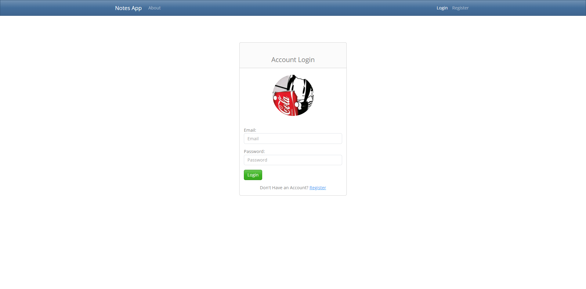

# PHP Notes App

Esta es una "replica" del [Aplicación de Notas de Fazt](https://github.com/fazt/nodejs-notes-app) solo que hecho con PHP y MySQL. Contiene algunas personalizaciones en cuanto a la presentación.



## Instalación

Modificar la clase [models/Model.abstract.php](models/Model.abstract.php)
```php
<?php

abstract class Model {

    public $id;
    public $created_at;
    public $updated_at;

    protected const DATABASE_HOST = '<HOST>';

    protected const DATABASE_USER = '<USUARIO>';

    protected const DATABASE_PASSWORD = '<CONTRASENA>';

    protected const DATABASE_NAME = '<BASE_DE_DATOS>';

    protected static function getConnection()
    {
        $conn =  mysqli_connect(Model::DATABASE_HOST, Model::DATABASE_USER, Model::DATABASE_PASSWORD, Model::DATABASE_NAME);

        if ($conn->connect_error) {
            die('Failed to connect: '.$conn->connect_error);
        }
        return $conn;
    }
}
```

## Links
- [Video Tutorial Aplicación de Notas Fazt](https://www.youtube.com/watch?v=8sXcFXFOWK4)